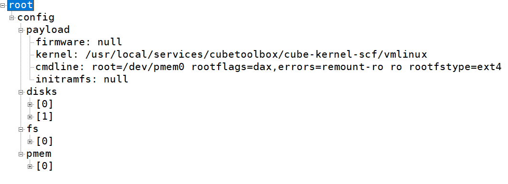
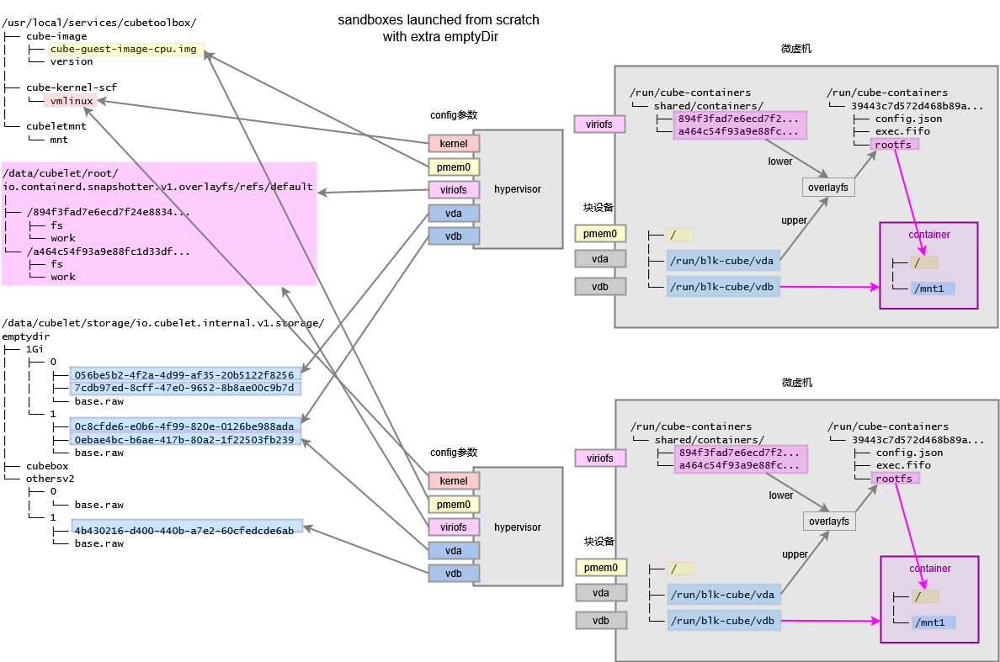
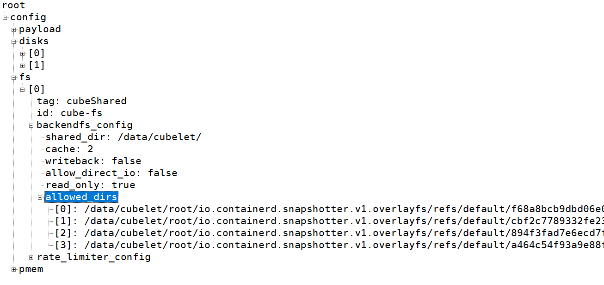
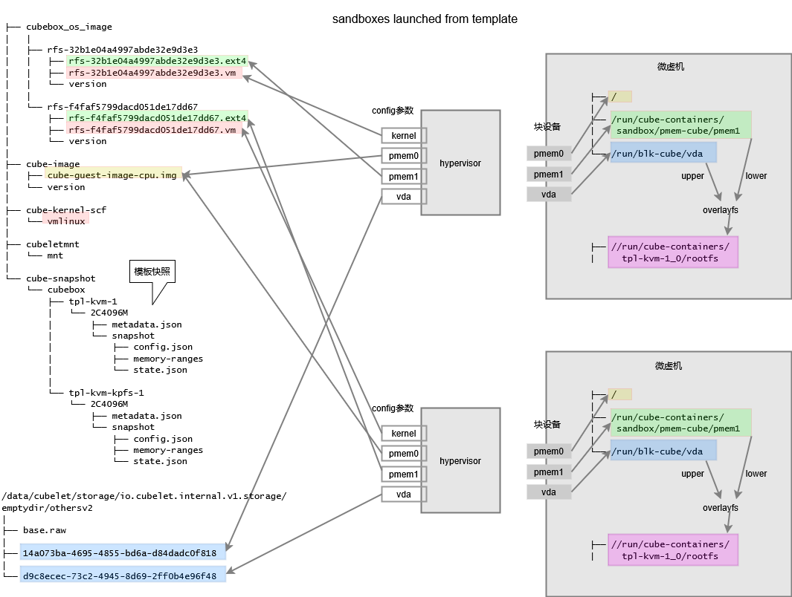

+++
date = '2026-06-26T16:25:24+08:00'
title = 'CubeSandbox Storage Analysis'
tags = ["CubeSandbox", "Storage", "sandbox"]
+++

# 1. CubeSandbox Storage

[CubeSandbox](https://github.com/TencentCloud/CubeSandbox/) creates Micro Virtual Machines (MVMs) on the host, and runs containers inside the MVMs. There are many options and issues regarding the handling of the MVM system disk, container images, and container writable layers, such as:

- Is the MVM system disk writable?

- Do multiple MVMs' system disks produce duplicate page cache?

- Are container images stored on the host or inside the MVM?

- How is the container's writable layer implemented?

- How is the container writable layer's content saved as a snapshot? When starting a sandbox from a snapshot, how does the container see the writable layer content?

The author investigated these questions in a version 0.1.1 test environment and organized the findings into diagrams, shared here in hopes of being helpful.

# 2. MVM vm.info

vm.info contains all configuration information of the MVM, including kernel boot parameters, block device configuration, virtiofs configuration, network configuration, etc.

Taking sandbox id 4d656bd35c9848f7abce297cd7cab6d2 as an example, you can retrieve the MVM's vm.info with the following command:

```shell
curl --unix-socket /run/vc/vm/4d656bd35c9848f7abce297cd7cab6d2/chapi http://localhost/api/v1/vm.info | jq
```

Partial vm.info content:



# 3. Two Ways to Start a Sandbox

CubeSandbox mainly has two ways to start a sandbox:

- Create from image

- Restore from snapshot

Under these two approaches, the handling of the system disk, container image, and container writable layer differs. The following sections explain each scenario separately.

# 4. Creating a Sandbox from an Image

## 4.1 The req.json for Creating a Sandbox

```json
{
    "volumes" : [
        {
            "name" : "rootfs-wlayer",
            "volume_source" : {
                "empty_dir" : {
                    "SizeLimit" : "1Gi"
                }
            }
        },
        {
            "name" : "tmp",
            "volume_source" : {
                "empty_dir" : {
                    "SizeLimit" : "2Gi"
                }
            }
        }
    ],
    "containers" : [
        {
            "name" : "nginx",
            "image" : {
                "image" : "nginx:latest"
            },
            "command" : [ "sleep" ],
            "args" : [ "1000000" ],
            "volume_mounts" : [
                {
                    "name" : "rootfs-wlayer",
                    "container_path" : "/"
                },
                {
                    "name" : "tmp",
                    "container_path" : "/mnt1"
                }
            ],
            "resources" : {
                "cpu" : "500m",
                "mem" : "512Mi"
            },
            "security_context" : {
                "readonly_rootfs" : false
            }
        }
    ]
}
```

This specifies two empty_dir volumes. One serves as the container's writable layer, and the other is similar to an emptyDir local ephemeral storage volume in k8s. Later sections will detail their implementation principles.

Run the command `cubecli cubebox create req.json` or

`cubecli multirun req.json` to create the sandbox.

## 4.2 Storage Architecture Overview

The diagram below describes the mapping relationship between the sandbox's MVM system disk, container image, container writable layer, and empty_dir storage volumes. Later sections provide detailed explanations.


## 4.3 MVM System Disk

### 4.3.1 Image File

From the content of vm.info's `.config.payload.cmdline` field `root=/dev/pmem0 rootflags=dax,errors=remount-ro ro rootfstype=ext4`, we can determine that the system disk inside the MVM is /dev/pmem0.

From vm.info's `.config.pmem[0].file` field, we can determine that this virtual pmem block device's content comes from `/usr/local/services/cubetoolbox/cube-image/cube-guest-image-cpu.img`, which is the MVM's system disk image.

```shell
# file /usr/local/services/cubetoolbox/cube-image/cube-guest-image-cpu.img
/usr/local/services/cubetoolbox/cube-image/cube-guest-image-cpu.img: Linux rev 1.0 ext4 filesystem data, UUID=80960e03-c2f6-4caf-9d17-a8fd92aaa0ba (extents) (64bit) (large files) (huge files)
```

This is a raw image file. You can manually mount it locally as a loop device to view its contents:

```shell
# mount -o loop,ro  /usr/local/services/cubetoolbox/cube-image/cube-guest-image-cpu.img /mnt/guest-img
```

The above command first creates a virtual block device /dev/*loop*x associated with this raw image file, then mounts the filesystem (ext4) on that block device to the specified path.

### 4.3.2 pmem Device

This raw image file is virtualized as a pmem block device and presented to the MVM. Theoretically, virtio-blk could also be used here. Using pmem + filesystem mount with read-only and DAX options (-o dax) brings two benefits:

1. When the filesystem (ext4) inside the MVM accesses data, it bypasses the block I/O request (bio) path and reads memory directly, providing better performance

2. Page cache is bypassed inside the MVM, avoiding additional page cache memory overhead

Note that the MVM system disk is mounted read-only.

## 4.4 Container Image

### 4.4.1 Container Image on the Host

When starting a sandbox directly from an image, the container image must first be downloaded to the host and expanded using containerd's overlayfs snapshotter, as follows:

```
/data/cubelet/root/io.containerd.snapshotter.v1.overlayfs/refs/default
│
├── /f68a8bcb9dbd06e0d2750eabf63c45f51734a72831ed650d2349775865d5fc20 
│   ├── fs
│   └── work
├── /cbf2c7789332fe231e8defa490527a7b2c3ae8589997ceee00895f3263f0a8cf
│   ├── fs
│   └── work
├── /894f3fad7e6ecd7f24e88340a44b7b73663a85c0eb7740e7ade169e9d8491a4c
│   ├── fs
│   └── work
└── /a464c54f93a9e88fc1d33df1e0e39cca427d60145a360962e8f19a1dbf900da9
    ├── fs
    └── work
```

Each subdirectory corresponds to a layer of the image. All layers of all container images downloaded on this host will appear here. Only the 4 layers of the container image used by one sandbox are shown above.

### 4.4.2 virtiofs Mapping

The `.config.fs` section of vm.info



As you can see, all 4 layer directories are mapped into the MVM via virtiofs. When mounting virtiofs inside the MVM, you need to specify tag=cubeShared.

Note that the `backendfs_config.cache` value in this virtiofs configuration is 2. The meanings of different values:

| cache value | Policy Name | Core Behavior                                                              | Consistency / Performance Tradeoff  |
| ----------- | ----------- | -------------------------------------------------------------------------- | ----------------------------------- |
| 0           | none        | Disable Guest caching, every IO fetches from Host                          | Best consistency, worst performance |
| 1           | auto        | Metadata cache expires after 1 second, data uses close-to-open consistency | Balanced, recommended default       |
| 2           | always      | All content cached permanently, never proactively invalidated              | Best performance, worst consistency |

Therefore, page cache of container image content will be generated inside the MVM. If multiple sandboxes on the same host use the same container image, duplicate page cache will be generated inside the MVMs.

## 4.5 Container Writable Layer

### 4.5.1 virtio-blk Image File on the Host

From vm.info's `.config.disks[0]` and `.config.disks[1]`, two virtio-blk block devices are defined. The data of these two virtual block devices is actually stored in two raw image files on the host, pointed to by `disks[0].path` and `disks[1].path`. Both raw image files are located under the `/data/cubelet/storage/io.cubelet.internal.v1.storage/emptydir` directory. The directory structure is as follows:

```shell
/data/cubelet/storage/io.cubelet.internal.v1.storage/emptydir
├── 1Gi
│   ├── 0
│   │   ├── 16ab3912-6b41-474d-b971-012d95bfd917
│   │   ├── 7cdb97ed-8cff-47e0-9652-8b8ae00c9b7d
│   │   └── base.raw
│   └── 1
│       ├── 0c8cfde6-e0b6-4f99-820e-0126be988ada
│       ├── 0ebae4bc-b6ae-417b-80a2-1f22503fb239
│       └── base.raw
├── cubebox
└── othersv2
    ├── 0
    │   └── base.raw
    └── 1
        ├── 4b430216-d400-440b-a7e2-60cfedcde6ab
        └── base.raw
```

Files like `1Gi/0/16ab3912-6b41-474d-b971-012d95bfd917` are raw image files for the MVM's virtio-blk block devices. Their content is initially an empty ext2 filesystem. You can also mount them to a local directory on the host using `mount -o loop` to view their contents.

The capacity of these virtio-blk devices can be specified, with a default of 1G. Those with 1G capacity are placed under the `1Gi` subdirectory, and others under the `othersv2` subdirectory.

### 4.5.2 Reflink and Preheating Pool for virtio-blk Image Files

To speed up sandbox creation and reduce disk space overhead, two optimization measures are adopted:

1.  reflink

2.  Pre-creation

Reflink (Copy-on-Write Link) is an efficient file cloning mechanism unique to CoW (Copy-on-Write) filesystems. A regular copy replicates not only the inode but also all data blocks. A reflink copy, however, does not copy the file's data blocks; it only creates independent file metadata (inode), and the two files share the underlying disk data blocks. Only when one of the files is modified does the filesystem copy the modified data blocks, after which the two files become independent.

Currently, the ext filesystem does not support reflink, while xfs and btrfs do. Therefore, it is recommended to use the xfs filesystem for the `/data/cubelet` directory. At startup, plugin.go's `checkPoolType()` automatically detects whether reflink is supported and falls back to regular copy if not.

**PoolDefaultFormatSizeList** (default: ["1Gi"]) defines which sizes of raw image files to pre-create. Taking "1Gi" as an example, cubelet pre-creates 100 subdirectories numbered 0 to 99 under `/data/cubelet/storage/io.cubelet.internal.v1.storage/emptydir/1Gi`, each containing a pre-created base.raw image file. It also creates a certain number of raw image files via reflink from the base.raw in the same subdirectory. When cubelet needs a new raw image file for sandbox creation, it first fetches one from the pre-created pool, further eliminating the time cost of executing reflink.

The creation logic for base.raw is in the function `newExt4BaseRaw(filePath, uuid string, size int64) error`, with the following flow:

 `touch → truncate → mkfs.ext4 → mount → mkdir → umount`

The `othersv2` subdirectory also has 100 pre-created subdirectories numbered 0 to 99, each with a pre-created base.raw, but no pre-created reflink pool of raw image files. If the requested capacity, after normalization by `normalizeRootfsSizes`, does not fall within the pre-created pool, it will be created on-demand under the `othersv2` subdirectory — first by performing a reflink from base.raw, then executing **truncate + e2fsck + resize2fs** to expand to the requested capacity.

**Note**: This logic has undergone significant changes in subsequent versions. The author plans to cover this separately when time permits.

### 4.5.3 virtio-blk Block Devices Inside the MVM

Log into the MVM via `cube-runtime login` and run `df -h` to see the virtual disk and filesystem mount status:

```shell
bash-5.2# df -h
Filesystem      Size  Used Avail Use% Mounted on
/dev/root       739M  546M  140M  80% /
devtmpfs        227M     0  227M   0% /dev
tmpfs           231M     0  231M   0% /dev/shm
tmpfs           231M   28K  231M   1% /run
tmpfs           231M     0  231M   0% /sys/fs/cgroup
cubeShared      200G  4.2G  196G   3% /run/cube-containers/shared/containers
shm             231M     0  231M   0% /run/cube-containers/sandbox/shm
/dev/vda        1.1G   84K  1.1G   1% /run/blk-cube/vda
/dev/vdb        1.1G   32K  1.1G   1% /run/blk-cube/vdb
overlay2        1.1G   84K  1.1G   1% /run/cube-containers/b48b9c87427847feb4595394a187d46b/rootfs
```

Among them, /dev/vda and /dev/vdb are two virtio-blk block devices, mounted to /run/blk-cube/vda and /run/blk-cube/vdb respectively.

### 4.5.4 overlayfs Mount Inside the MVM

Here vda serves as the container's writable layer. You can see the overlayfs mount created for the container via the mount command:

```shell
bash-5.2# mount
/dev/pmem0 on / type ext4 (ro,relatime,errors=remount-ro,dax=always)

/dev/vda on /run/blk-cube/vda type ext4 (rw,relatime)
/dev/vdb on /run/blk-cube/vdb type ext4 (rw,relatime)

cubeShared on /run/cube-containers/shared/containers type virtiofs (ro,relatime)

overlay2 on /run/cube-containers/b48b9c87427847feb4595394a187d46b/rootfs type overlay (rw,relatime,lowerdir=/run/cube-containers/shared/containers/f68a8bcb9dbd06e0d2750eabf63c45f51734a72831ed650d2349775865d5fc20/fs:/run/cube-containers/shared/containers/cbf2c7789332fe231e8defa490527a7b2c3ae8589997ceee00895f3263f0a8cf/fs:/run/cube-containers/shared/containers/894f3fad7e6ecd7f24e88340a44b7b73663a85c0eb7740e7ade169e9d8491a4c/fs:/run/cube-containers/shared/containers/a464c54f93a9e88fc1d33df1e0e39cca427d60145a360962e8f19a1dbf900da9/fs,upperdir=/run/blk-cube/vda/disk/b48b9c87427847feb4595394a187d46b/upper,workdir=/run/blk-cube/vda/disk/b48b9c87427847feb4595394a187d46b/work,uuid=on)
```

The last item is the overlayfs mount.

The lowerdir of overlayfs consists of the 4 container image layer directories mounted into the MVM via virtiofs (under the /run/cube-containers/shared/containers directory).

The upperdir of overlayfs `/run/blk-cube/vda/disk/b48b9c87427847feb4595394a187d46b/upper` is a subdirectory under the vda mount point `/run/blk-cube/vda/`.

The overlayfs is mounted to `/run/cube-containers/b48b9c87427847feb4595394a187d46b/rootfs`. This directory serves as the container's rootfs.

## 4.6 emptyDir

The virtio-blk block device vdb corresponds to the empty_dir ephemeral volume defined in the req.json for creating the sandbox earlier. Its mount point inside the MVM is `/run/blk-cube/vdb`, and when creating the container, it will be bind-mounted to the specified path under the container's rootfs.

# 5. Creating a Sandbox from a Snapshot

## 5.1 Snapshot Content and Storage Path

Snapshots include three types of data:

1. Static images
   
   - MVM system disk image
   
   - Container image

2. Snapshot metadata

3. CPU and memory state

This data is stored in the following paths:

```shell
/usr/local/services/cubetoolbox
├── cubebox_os_image
│   │
│   ├── rfs-32b1e04a4997abde32e9d3e3
│   │   ├── rfs-32b1e04a4997abde32e9d3e3.ext4
│   │   ├── rfs-32b1e04a4997abde32e9d3e3.vm
│   │   └── version
│   │
│   └── rfs-f4faf5799dacd051de17dd67
│       ├── rfs-f4faf5799dacd051de17dd67.ext4
│       ├── rfs-f4faf5799dacd051de17dd67.vm
│       └── version
│   
│
└── cube-snapshot
    └── cubebox
        ├── tpl-kvm-1
        │   └── 2C4096M
        │       ├── metadata.json
        │       └── snapshot
        │           ├── config.json
        │           ├── memory-ranges
        │           └── state.json
        │ 
        └── tpl-kvm-kpfs-1
            └── 2C4096M
                ├── metadata.json
                └── snapshot
                    ├── config.json
                    ├── memory-ranges
                    └── state.json
```

## 5.2 Snapshot Image Content

The .ext4 files under the `cubebox_os_image/rfs-xxxx` path are relatively large. They contain the container image content packaged as an ext4 filesystem raw image. This file can also be mounted to a local directory on the host using `mount -o loop` to view its contents, which is equivalent to the filesystem view after stacking all layers of the container image.

The .vm files under `cubebox_os_image/rfs-xxxx` are kernel binaries. Normally, this .vm file is identical to `cubetoolbox/cube-kernel-scf/vmlinux`. However, considering that after taking a snapshot, `cubetoolbox/cube-kernel-scf/vmlinux` might be updated, if the sandbox is started from the snapshot using the updated `cubetoolbox/cube-kernel-scf/vmlinux`, the kernel symbol table would not match. Therefore, when taking a snapshot, a copy of the MVM's kernel binary must also be saved in the snapshot.

One issue here is that the MVM system disk image always uses `cubetoolbox/cube-image/cube-guest-image-cpu.img` and does not include this image in the snapshot. The author believes this is problematic, because `cubetoolbox/cube-image/cube-guest-image-cpu.img` could also be updated. If a snapshot was previously taken with an older system image, creating a sandbox again would update the MVM system disk content, which would not be the same as when the snapshot was taken. The author plans to submit a PR to the community to address this potential issue.

## 5.3 Snapshot Metadata, CPU and Memory State

The subdirectories under `cubetoolbox/cube-snapshot/cubebox` are named by template name and contain the metadata `metadata.json`, CPU state `state.json`, and memory snapshot `memory-ranges`.

## 5.4 Storage Architecture Overview



## 5.5 MVM System Disk

The MVM system disk logic is exactly the same as the "creating sandbox from image" method. The system disk raw image is mounted to the MVM via virtual device pmem0 and serves as the MVM's root directory.

## 5.6 Container Image and Container Writable Layer

This is the main difference from the "creating sandbox from image" method.

The container image is packaged as an ext4 filesystem raw image file and mounted to the MVM as virtual block device pmem1.

The container writable layer logic is consistent with the "creating sandbox from image" method, still using an ext2 raw image file under the host's `/data/cubelet/storage/io.cubelet.internal.v1.storage/emptydir` directory, virtualized as a virtio-blk block device (vda) and mounted to the MVM.

## 5.7 overlayfs Mount Inside the MVM

```shell
bash-5.2# mount

/dev/pmem0 on / type ext4 (ro,relatime,errors=remount-ro,dax=always)

/dev/pmem1 on /run/cube-containers/sandbox/pmem-cube/pmem1 type ext4 (ro,relatime,dax=always)

/dev/vda on /run/blk-cube/vda type ext4 (rw,relatime)

overlay2 on /run/cube-containers/tpl-kvm-1_0/rootfs type overlay (rw,relatime,lowerdir=/run/cube-containers/sandbox/pmem-cube/pmem1/,upperdir=/run/blk-cube/vda/disk/tpl-kvm-1_0/upper,workdir=/run/blk-cube/vda/disk/tpl-kvm-1_0/work,uuid=on)
```

As you can see, inside the MVM, the ext4 filesystem on the pmem1 block device is mounted to `/run/cube-containers/sandbox/pmem-cube/pmem1`, then this directory serves as the lowerdir of overlayfs, the subdirectory `/run/blk-cube/vda/disk/tpl-kvm-1_0/upper` on vda serves as the upperdir of overlayfs, and the merged overlay view is mounted to `/run/cube-containers/tpl-kvm-1_0/rootfs`, which serves as the container's rootfs.

# 6. Comparison of Storage Architectures Between the Two Methods

The main difference lies in the handling of container images:

|                                                     | Creating sandbox from image                                                | Creating sandbox from snapshot                                           |
| --------------------------------------------------- | -------------------------------------------------------------------------- | ------------------------------------------------------------------------ |
| Container image on host                             | One subdirectory per layer, consistent with containerd's default mechanism | Merged view of all layers, packaged as an ext4 filesystem raw image file |
| How container image is transferred from host to MVM | virtiofs (cache=always)                                                    | pmem block device (DAX)                                                  |
| Page cache inside MVM                               | Produces duplicate page cache                                              | No page cache overhead                                                   |

According to the E2B protocol, sandboxes must be created from templates. However, in scenarios using CubeSandbox, it is not ruled out that sandboxes may need to be created directly from images without going through template snapshots. In this scenario, using pmem for container images provides better I/O performance and memory efficiency, with the drawback being an additional step to package the container image as a raw image.
